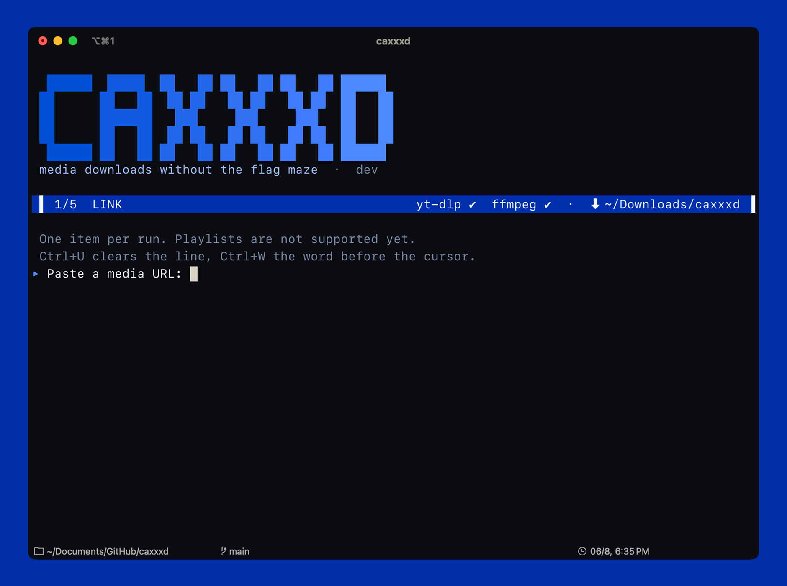

# caxxxd

> media downloads without the flag maze

there are plenty of `yt-dlp` wrappers. this one is mine.

`caxxxd` is a small, opinionated terminal frontend for downloading video,
audio, or plain-text subtitles on macOS. it turns the usual pile of format
selectors, container flags, and ffmpeg choices into a short conversation you
can actually follow.



## primary goals

this project is for people who like what `yt-dlp` can do, but do not want to
memorise its entire command line every time they save a clip.

you can expect:

  * a five-step flow with a clear screen for every decision
  * metadata before the download starts: title, uploader, platform, duration
  * time-range downloads that fetch only the requested section when the source
    supports seeking
  * friendly video and audio presets for the common cases
  * uploaded and automatic subtitles as clean UTF-8 text without the media
  * an exact stream table when the preset is not enough
  * real progress with size, speed, ETA, and post-processing state
  * a remembered download folder
  * `Ctrl+C` cancellation that targets `yt-dlp` and the `ffmpeg` process it
    started
  * no shell command construction: URLs are passed to `yt-dlp` as arguments

the defaults are deliberately opinionated. MKV is the safe video default,
best source audio is the safe audio default, and playlists are not silently
expanded.

## why should i use this over `yt-dlp` directly?

you probably should not if you enjoy writing format selectors by hand. the
original tool is more powerful, more configurable, and already very good.

use `caxxxd` if you want a small front end that:

  * shows what it found before it writes anything
  * lets you choose quality without consulting a man page
  * explains the trade-offs between containers and audio formats
  * keeps the useful part of the terminal output visible without turning the
    screen into a wall of flags

this is not trying to replace `yt-dlp`. it is a calmer way to drive it.

## open source means open

the project is released under the MIT license. within that license, do
whatever you want with it:

  * use it privately or commercially
  * fork it and make it fit your workflow
  * remove the presets, replace the UI, or rewrite the process layer
  * ship your own modified binaries
  * copy the ideas into another tool

keep the copyright and license notice where the MIT license requires it. apart
from that, there is no special permission needed to experiment with your own
version. if a feature is not right for you, delete it or make a better one.

## how it works

### local browser cookies

Run `caxxxd --cookies` to enable or disable cookies using an arrow-key menu.
Choose the browser where you are already signed in, then paste the media URL.
The choice is remembered for future runs; choose **Off** to stop using it.
Safari, Chrome, Firefox, Brave, Edge, Chromium, Opera, and Vivaldi are supported.

Cookies are off by default. yt-dlp reads them locally on each metadata lookup
and download, including subtitles. caxxxd stores only the browser name in its
private preferences; it does not export cookies to a file. macOS may request
Keychain access or permission to read browser data. If access fails, check
those permissions or choose another signed-in browser. No anonymous retry is
performed silently.

caxxxd ignores global yt-dlp configuration so external cookie, output, or
playlist options cannot override this flow. A signed-in session may help with
account restrictions, but does not guarantee that a site will accept a request.
For HTTP 403 errors, update yt-dlp (`brew upgrade yt-dlp`) and try again.

### process integration

`caxxxd` keeps the boundary with the external tools intentionally boring:

  * `yt-dlp --dump-single-json` provides metadata, formats, and subtitle tracks
  * a structured progress template provides download events
  * command arguments are assembled as a slice, never as a shell string
  * `ffmpeg` handles merging, remuxing, and requested audio conversions
  * the downloader runs as a process group so cancellation reaches children

the terminal layer is written in Go with `pterm`, `x/term`, and
`go-runewidth`. preferences are stored as a small JSON file under the macOS
application support directory.

## requirements

  * macOS 13 or newer
  * Go 1.26+ when building from source
  * a terminal at least 60 columns wide
  * [yt-dlp](https://github.com/yt-dlp/yt-dlp)
  * [ffmpeg](https://ffmpeg.org)

`ffprobe`, which is shipped with ffmpeg, is used to inspect the first packet
when a clipped download needs local timestamp normalization.

`caxxxd` does not bundle or install the external tools itself. it checks for
them on startup and tells you what is missing.

## install

### Homebrew

```bash
brew install ballisarium/tap/caxxxd
```

the cask brings `yt-dlp` and `ffmpeg` along as dependencies. then run:

```bash
caxxxd
```

### From source

install the dependencies first:

```bash
brew install yt-dlp ffmpeg
```

then install the command:

```bash
go install github.com/ballisarium/caxxxd/cmd/caxxxd@latest
```

or build a local binary from a checkout:

```bash
go build -trimpath -o ./dist/caxxxd ./cmd/caxxxd
```

## update

### Homebrew

```bash
brew update
brew upgrade caxxxd
```

### From source

```bash
go install github.com/ballisarium/caxxxd/cmd/caxxxd@latest
```

check the installed version with:

```bash
caxxxd --version
```

`caxxxd update` is not a supported command.

## usage

```bash
caxxxd
caxxxd "https://www.youtube.com/watch?v=..."
caxxxd --section 05:30-06:20 "https://www.youtube.com/watch?v=..."
caxxxd --section 90-120 "https://www.youtube.com/watch?v=..."
caxxxd --help
caxxxd --version
```

the URL can be pasted into the first prompt or supplied as a command-line
argument. one item is processed per run. playlists are currently out of scope
and `--no-playlist` is always passed to `yt-dlp`.

### time ranges

`--section START-END` downloads one fragment instead of the whole item. both
endpoints accept seconds (`90`), minutes and seconds (`05:30`), or hours,
minutes, and seconds (`01:05:30`). the start must be before the end, and the
end must fit inside the duration reported by `yt-dlp`; invalid ranges stop
before the download starts.

you can also choose the range inside the interactive flow. after caxxxd reads
the media details, choose `Whole video` to keep the complete item or
`Choose a range` to enter `START-END` in one prompt. the prompt shows the
video duration, explains the accepted formats, and stays on the same input
after an invalid value so a typo does not restart the flow. at the final
review, `Change time range` opens the same editor again without making you
repeat the video and format choices.

for example, an interactive clipped download looks like this:

```text
Time range
  Whole video       download all 2:05
▸ Choose a range    download only part of this video
  ‹ Back            return to the URL

Time range: 00:30-01:20
Use SS, MM:SS, or HH:MM:SS. Video duration: 2:05.
```

for video and audio, the range is passed to `yt-dlp` as
`--download-sections`, so the source is sought directly whenever the selected
format allows it. after yt-dlp has merged the short result, caxxxd reads the
first local media packet and runs one timestamp-normalization pass with
`ffmpeg -ss LOCAL_START -t LENGTH -c copy`. this accounts for keyframe padding
and independent video/audio timestamps without seeking past the already-short
file. the result replaces the downloaded file atomically, which keeps
independently fetched video and audio streams on one clean timeline.

subtitle tracks are small and carry their own cue times, so caxxxd downloads
the selected track without video or audio and filters its cues locally. it
never invokes the media clipping pass.

caxxxd does not force keyframes or do a full re-encode. stream copy keeps
clipping fast and leaves the original codecs untouched. as a result, the
actual first and last frame can be close to the requested timestamps rather
than frame-perfect. clipped files include the range in their filename so they
do not collide with a full download of the same item.

for audio-only clips, the audio and metadata stay stream-copied. an embedded
thumbnail is omitted when the target audio container cannot carry it as a
copied stream.

downloads go to `~/Downloads/caxxxd` by default. the review step lets you
change the folder, and the choice is remembered in:

```text
~/Library/Application Support/caxxxd/config.json
```

## controls

| key | action |
| --- | --- |
| `↑` `↓` | move through a menu |
| `Enter` | confirm a choice or submit text |
| typing | filter a long menu or edit a text field |
| `Ctrl+U` | clear the current line |
| `Ctrl+W` | delete the word before the cursor |
| `Ctrl+A` `Ctrl+E` | move to the start or end of the line |
| `Ctrl+C` | cancel the current operation or leave a prompt |

there are no letter shortcuts to memorise. going back is a menu option, so
the flow behaves the same on an English, Cyrillic, or Greek keyboard layout.

## formats and quality

### video

video is never transcoded by `caxxxd`. it asks `yt-dlp` for the best streams it
can find and lets `ffmpeg` merge or remux them.

| container | default behavior |
| --- | --- |
| MKV | best video and best audio, whatever codecs the site offers |
| MP4 | H.264 video with AAC/M4A audio where available |
| WebM | VP9/AV1 video with Opus audio where available |

MP4 and WebM can require a lower resolution when a site does not offer
compatible codecs at its highest resolution. MKV is the default because it
does not force that trade-off.

### audio

audio defaults to **Best source audio**, which keeps the existing stream
without an unnecessary re-encode. Opus, M4A, MP3, FLAC, and WAV presets are
available when a specific output format matters.

FLAC and WAV cannot recover detail that a lossy source already discarded.
`caxxxd` warns before those conversions instead of pretending that a larger
file is automatically a better source.

### subtitles

subtitle mode downloads one uploaded or automatic language track without the
video or audio. uploaded tracks are listed first; automatic tracks are kept
separate and labelled because speech recognition can be wrong.

the output is one UTF-8 `.txt` file. caxxxd removes cue numbers, timestamps,
SRT/VTT styling, and repeated rolling text from automatic captions. line
breaks and meaningful cues such as `[Music]` remain readable. the temporary
subtitle file is removed before success is reported, and the TXT replaces its
destination atomically only after conversion succeeds.

if the source has no subtitle tracks, caxxxd says so before starting a
download. it does not transcribe speech from the audio; that would be a
different feature.

## limitations

this is a focused tool, not a complete media manager:

  * one item per run; playlist workflows are not implemented yet
  * authentication, DRM bypass, and account handling are out of scope
  * macOS is the supported runtime because the app reveals completed files with
    Finder
  * an interactive TTY is the intended surface; redirected output is not yet
    a clean, feature-equivalent transcript mode
  * cancelling a video or audio download can leave a `.part` file so a later
    run can resume it; cancelling subtitles leaves no partial transcript

## repository layout

  * `cmd/caxxxd/`: executable entry point
  * `internal/app/`: five-step flow and download lifecycle
  * `internal/ui/`: palette, terminal chrome, editor, menus, and live progress
  * `internal/domain/`: media modes, containers, presets, and shared vocabulary
  * `internal/ytdlp/`: metadata, format normalization, command building,
    subtitle-to-text conversion, and process streaming
  * `internal/deps/`: `yt-dlp` and `ffmpeg` detection
  * `internal/config/`: persisted preferences
  * `internal/process/`: Unix process-group termination
  * `docs/`: project screenshots

## contributing

forks and pull requests are welcome. keep changes small enough to understand,
and explain the user-visible behavior they change.

before opening a large feature, an issue or discussion is useful: the project
is intentionally opinionated, and a feature that makes the common path louder
may not belong in the default flow.

run the local checks before sending a change:

```bash
gofmt -w .
go vet ./...
go test ./... -race -count=1
go build ./...
```

the tests use JSON fixtures and fake services, so the normal test suite does
not need a network account or a live media site.

## legal

download only media that you own, that is licensed for download, or that you
are otherwise authorised to save. respect the terms of service of the sites
you use and the rights of the people who made the media.

`caxxxd` is a convenience wrapper around `yt-dlp`. how you use it is your
responsibility.

## license

MIT. see [LICENSE](LICENSE).
