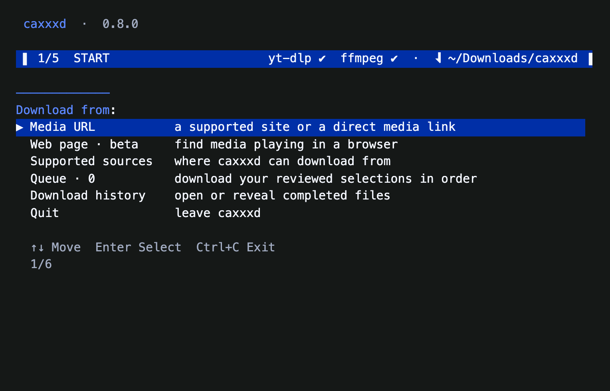

# caxxxd

> media downloads without the flag maze

a small terminal frontend for `yt-dlp` and `ffmpeg` on macOS. download video,
audio, or plain-text subtitles through a short conversation.



## install and update

requires macOS 13 or newer. Homebrew installs the external tools too.

```bash
brew install --cask ballisarium/tap/caxxxd
caxxxd
```

to update:

```bash
brew update
brew upgrade --cask caxxxd
caxxxd --version
```

or download an Apple Silicon / Intel archive from
[Releases](https://github.com/ballisarium/caxxxd/releases).
manual installations also need `yt-dlp`, `ffmpeg`, and `ffprobe` on `PATH`.

## use it

choose **Media URL** or **Web page · beta** in the opening menu. **Supported
sources** explains the available sources. after selecting media, choose the
whole item or a clip, pick video, audio, or subtitles, then review and download.
the destination folder is remembered. passing a URL on the command line goes
straight to the media URL prompt.

use the arrow keys and Enter to choose; Ctrl+C exits. long lists support
typing to filter and Ctrl+U to clear the filter. the menu shows your position
and scrolls to fit the window. when a row is shortened, its selected description
appears below the list. the interface supports terminals from 40 columns wide.
after a successful download, **Open file** launches the default app and
**Reveal in Finder** shows the saved file.

```bash
caxxxd
caxxxd "https://www.youtube.com/watch?v=..."
caxxxd --help
```

### capture media from a web page · beta

requires Google Chrome, Chromium, or Microsoft Edge in `/Applications`,
`~/Applications`, or on `PATH`. no browser is installed automatically.

1. choose **Web page · beta**, enter the page address, and choose a browser.
2. play the media in the capture tab; sign in there if needed.
3. return to the terminal; the captured list updates automatically.
4. choose a captured resource, review the format, and download. keep the
   browser open until the download finishes. **Back** leaves the capture list;
   a browser needed by queued downloads stays connected until they finish.

capture watches network responses, including embedded players and new tabs,
for direct video/audio files, HLS playlists, and DASH manifests. individual
stream fragments are excluded. the first 200 distinct resources are kept.
capture continues if the page opens the player in a new tab and redirects the
original tab to advertising. the list sorts known sizes from largest to
smallest. direct files use HTTP `Content-Length` or the full `Content-Range`
total, rather than the size of a downloaded range. HLS/DASH sizes use complete
playlist byte ranges or duration and bitrate where available; `~` marks an
estimate. a playlist's own text size is never shown as the video's size.
unknown and live-stream totals remain **size unknown**. larger size is a useful
clue, but does not establish which resource is the original video.
the list also shows resolution, duration, codecs, and the player/source host
when available. playback properties come from captured players, including
embedded frames; codecs come from manifests. variants explicitly referenced
by the same HLS master are grouped, with a second menu to select a stream.
unrelated resources are kept separate. updates preserve the selected row
while new resources arrive or sizes change. type to filter the list.
discovery follows the approach of [cat-catch](https://github.com/xifangczy/cat-catch),
implemented independently in Go using Chromium's DevTools Protocol;
cat-catch source code is not bundled.

**Separate browser** uses a disposable Chrome, Chromium, or Edge profile.
**My running Chrome** connects to the existing Chrome profile and opens a new
capture tab. first enable remote debugging in
`chrome://inspect/#remote-debugging`, then allow Chrome's connection dialog.
this requires a Chrome version that exposes the opted-in debugging endpoint;
Chrome 144 introduced this flow, but some later versions do not publish the
endpoint. caxxxd reports that condition rather than restarting your browser.
see [Chrome's connection documentation](https://developer.chrome.com/blog/chrome-devtools-mcp-debug-your-browser-session).

**Chrome debugging port** also connects to a browser you already started with
a loopback remote-debugging port. enter its port in the terminal. modern Chrome
requires a non-default profile for command-line remote debugging; for example:

```bash
"/Applications/Google Chrome.app/Contents/MacOS/Google Chrome" \
  --remote-debugging-port=9222 \
  --user-data-dir="$HOME/Library/Application Support/caxxxd-chrome"
```

this profile is managed by you and can keep your sign-in between runs. caxxxd
only disconnects when capture ends: it leaves the browser, tabs, and profile
open. connected capture watches its new tab and related players/popups, not
unrelated existing tabs. endpoints must be on loopback. Safari does not expose
a supported equivalent for capturing an ordinary open tab; its cookies can
still be used through **Media URL** and `--cookies`.

captured addresses stay out of the resource menu. request context and
domain-scoped cookies are passed to yt-dlp through private
temporary files, removed on normal exit or Ctrl+C. disposable profiles are
also removed; connected browser profiles are retained. captured downloads use
neutral filenames. a forced process kill or power loss can leave the temporary
profile in the system temporary directory.

this does not guarantee every page: DRM, browser-only blobs without a reusable
media URL, expiring links, partitioned cookies, and custom authorization headers
may prevent downloads. play or refresh the page and select a fresh resource
when a link expires. existing `--cookies` settings apply to **Media URL**;
browser capture uses the selected capture session.
connected sessions export cookies only for the selected media address; a
stream needing cookies on additional CDN hosts may need **Separate browser**.

### queue, history, and recovery

choose **Add to queue** on the review screen to save that selection. add more
links or captured streams, then choose **Queue** in the opening menu and
**Start queue**. downloads run in order using each item's reviewed format,
folder, and time range. you can inspect or remove waiting items. a failure
pauses for recovery; remaining items stay available. cancelling returns to
the review, where the same download can be resumed. the queue is held only
in memory and is discarded when caxxxd exits; source addresses are not saved.

**Download history** lists the last 100 verified local outputs, newest first.
open a file, show it in Finder, or repeat its format and folder settings with
a new URL. missing files remain marked **unavailable**. history is stored in
private `history.json` beside the preferences; it contains local paths and
format choices, without source addresses or cookies.

partial media downloads use `.part` files and resume where supported by
yt-dlp. HTTP and fragment failures receive up to five retries with a bounded
delay. unavailable fragments still fail the download. **Recapture stream**
returns a failed browser download to the captured list: play or reload the
page and choose a fresh resource if the old address has expired.

### choose a clip

select **Choose a range**, then follow three screens:

1. **Start at** — enter seconds (`90`) or a timecode (`1:30`, `0:01:30`).
2. **End at** — enter the ending position, not the clip length.
3. **Confirm this clip?** — check the start, end, and length, then select
   **Use this clip**. you can change either endpoint or cancel your edits.

the end must follow the start and fit inside the video. **Change time range**
on the review screen lets you revise the clip before downloading.

for a range you already know:

```bash
caxxxd --section 90-120 "https://www.youtube.com/watch?v=..."
```

a range supplied with `--section` stays fixed for that run. clips use stream
copy, so cuts can land near keyframes rather than at an exact frame.

### browser cookies

```bash
caxxxd --cookies
```

choose the local browser where you are signed in. the choice is remembered;
select **Off** to disable it. cookies are off by default.

yt-dlp reads cookies for each lookup and download. caxxxd saves only the browser
name, never a cookie export. macOS may ask for browser-data or Keychain access.
global yt-dlp configuration is ignored to keep this flow predictable.

if a site returns HTTP 403, try updating `yt-dlp` with `brew upgrade yt-dlp`
and selecting a signed-in browser. cookies cannot guarantee access to every item.

### controls and output

- `↑` / `↓` select; `Enter` confirms; typing filters long menus.
- `Ctrl+U` clears a text field; `Ctrl+C` exits from any prompt or menu,
  including after Escape or a partial paste. during a download, it cancels
  the operation and returns to the review screen.
- video preserves its codecs; MKV is the default. MP4 and WebM may limit quality
  to compatible source streams.
- audio defaults to the source format; MP3, M4A, Opus, FLAC, and WAV are available.
- subtitles produce one UTF-8 `.txt` from an uploaded or automatic track.
  no speech transcription is performed.
- cancelling a media download may leave a resumable `.part` file.
- completion requires a nonempty output file, not just a successful tool exit.
- missing HLS/DASH fragments fail the download instead of silently leaving gaps.

one item per link, with sequential queues and no playlists or DRM bypass. an
interactive terminal is required. download only media you are authorised to save.

## build and check

requires Go 1.26 and the external tools above.

```bash
go install github.com/ballisarium/caxxxd/cmd/caxxxd@latest
```

from a checkout:

```bash
gofmt -l .
go vet ./...
go test ./... -race -count=1
go build -o .scratch/caxxxd ./cmd/caxxxd
git diff --check
```

optional local integration check (Chrome, yt-dlp, ffmpeg, and ffprobe required):

```bash
mkdir -p .scratch
CAXXXD_BROWSER_TEST=1 TMPDIR="$PWD/.scratch" go test ./internal/browser -run TestLiveCapture -v -count=1
```

it generates short fixtures and verifies real downloads from local MP4, M4A, HLS,
DASH, and embedded players.

the normal test suite uses fixtures and fake services, without a network account.

### GitHub Actions

**CI** checks formatting, runs vet and race tests, and builds both macOS
architectures on main pushes and pull requests. It also supports manual runs.
**Release** runs the same checks, publishes tagged `v*` releases, updates the
Homebrew cask, and generates GitHub build attestations for the release archives.
The release job needs `HOMEBREW_TAP_TOKEN` with write access to
`ballisarium/homebrew-tap`; the token is stored only in GitHub Actions secrets.

A manual **Release** run builds an attested preview, available under the run's
artifacts for seven days. It does not publish a release or update Homebrew.

To verify an archive built by this workflow:

```bash
gh attestation verify caxxxd_VERSION_darwin_arm64.tar.gz --repo ballisarium/caxxxd
```

Earlier releases built locally do not have GitHub Actions attestations.

## license

MIT. see [LICENSE](LICENSE).
